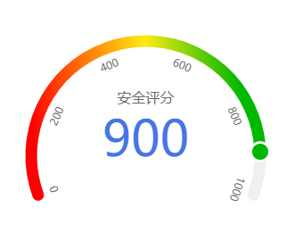

# 微信小程序仪表盘组件

基于canvas开发，功能不断叠加

**备注：数据刻度暂时定位人工分段，后期采用自动分割尺度**

## API

名称 类型 默认值  备注

| 名称                 | 类型                 | 默认值                                                       | 备注                                                         | 必填 |
| -------------------- | -------------------- | ------------------------------------------------------------ | ------------------------------------------------------------ | ---- |
| width                | `Number`             | 750                                                          | 单位为`rpx`                                                  | 否   |
| height               | `Number`             | 450                                                          | 单位为`rpx`                                                  | 否   |
| gaugeid              | `String `            | 'gauge' + Math.random()                                      |                                                              | 否   |
| r                    | ` Number `           | 95                                                           | 单位为`px`                                                   | 否   |
| startAngle           | `Number`             | 80 / 90 * Math.PI                                            | 角度制                                                       | 否   |
| endAngle             | `Number`             | 10 / 90 * Math.PI                                            | 角度制                                                       | 否   |
| bgColor              | `String`             | ` #f0f0f0`                                                   | 表盘底色                                                     | 否   |
| indicatorBgColor     | ` Array ` / `String` | 默认为数组，即渐变色，渐变色格式`[{progress:0,value:'#fff'},{progress:1,value:'red'}]`，详情参见源码 | 指示器颜色                                                   | 否   |
| bgWidth              | `Number`             | 15                                                           | 表盘宽度                                                     | 否   |
| min                  | `Number`             | 0                                                            |                                                              | 否   |
| max                  | `Number`             | 1000                                                         |                                                              | 否   |
| value                | `Number`             | 700                                                          |                                                              | 否   |
| animateMsec          | `Number`             | 0                                                            | 动画时长（毫秒），0表示无动画                                | 否   |
| indicatorText        | `String`             | -                                                            | 指示器文本                                                   | 否   |
| scale                | `Array`              | [0,200,400,600,800,1000]                                     | 指示器标尺刻度                                               | 否   |
| indicatorTextStyle   | `Object`             | `{show:false,size:12,color:'#666',text:''}`                  |                                                              | 否   |
| indicatorValueStyle  | `Object`             | `{show:false,size:18,color:'#4575e8'}`                       |                                                              | 否   |
| indicatorCircleStyle | `Object`             | `{show:false,bgColor:'#00b800',r:9,borderRadius:3,borderColor:'#fff'}` | `borderColor`可以为数组，当为数组时采用径向渐变，数组格式同`indicatorBgColor` | 否   |
| scaleTextStyle       | `Object`             | `{show:fasle,size:16,color:#f0f0f0}`                         |                                                              | 否   |

